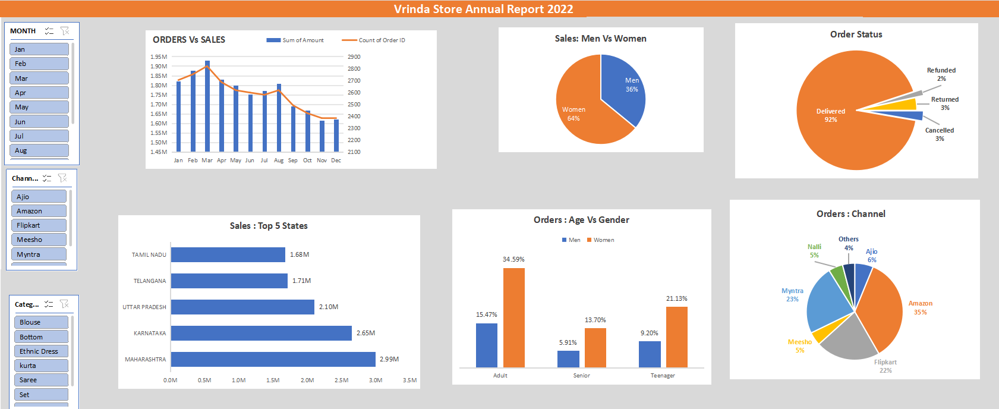
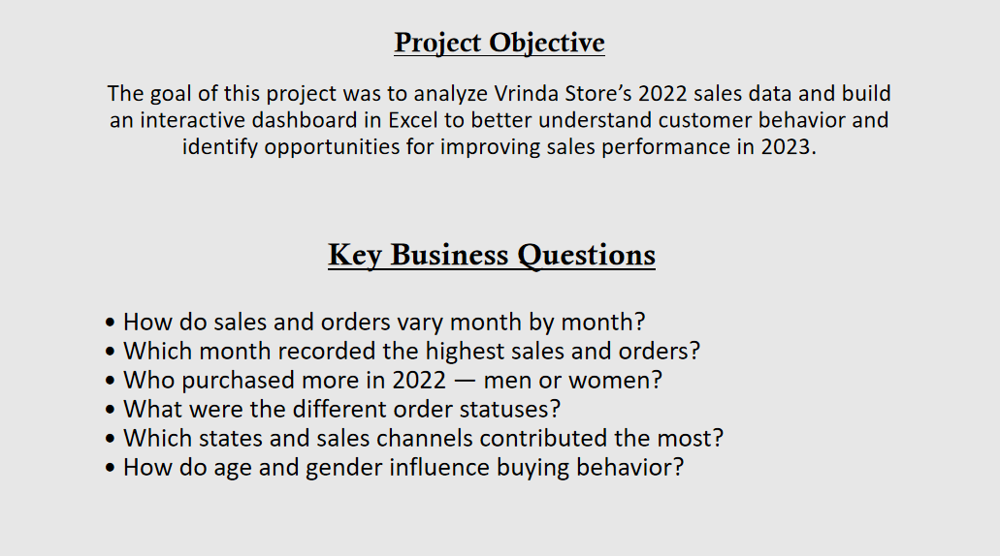

# Vrinda Store Sales Analysis (2022)

## 📊 Project Overview
This project analyzes the 2022 sales data of **Vrinda Store** using Excel and presents key insights through an interactive dashboard.

The goal is to understand customer behavior, sales trends, and performance across different regions and channels to support data-driven business decisions.

---

## 🎯 Business Objectives
- Analyze monthly sales and order trends  
- Identify top-performing states and sales channels  
- Understand customer behavior by age and gender  
- Examine order fulfillment performance

---

## 🧩 Key Insights
- Monthly **Orders vs Sales** comparison  
- **Sales by Gender** (Men vs Women)  
- **Order Status** breakdown (Delivered, Returned, Cancelled, Refunded)  
- **Top 5 States** contributing to sales  
- **Customer Age vs Gender** behavior  
- **Sales by Channel** (Amazon, Flipkart, Myntra, etc.)

---

## 🛠 Tools & Skills Used
- **Microsoft Excel**
- Pivot Tables
- Charts & Slicers
- Dashboard Design
- Data Cleaning & Analysis

---

## 🖼 Dashboard Preview

### Main Dashboard

### Project Objective & Business Questions

---

## 📁 Files in This Repository
- `Vrinda Store Data Analysis.xlsx` — Complete interactive dashboard file  
- `Dashboard_Overview.png` — Dashboard screenshot  
- `Project_Objective_and_Insights.png` — Project objectives & business questions  

---

## 🚀 Learning Outcome
This project strengthened my understanding of how raw data can be transformed into meaningful business insights using Excel and basic data analysis techniques.

